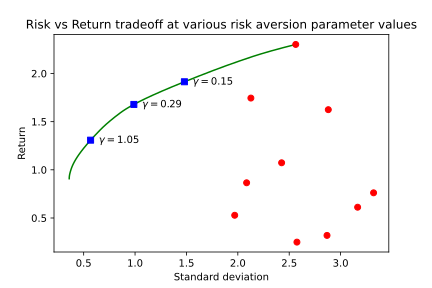
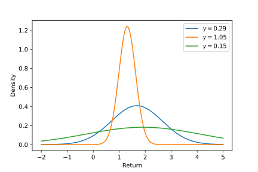
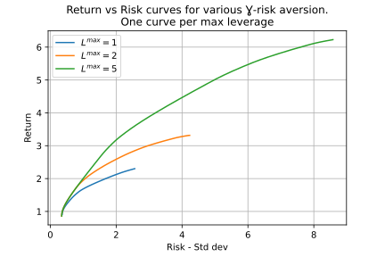
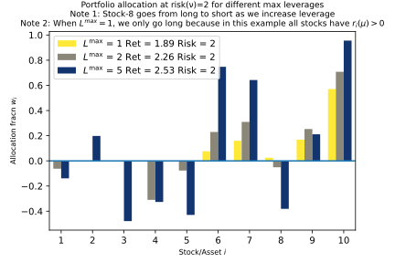
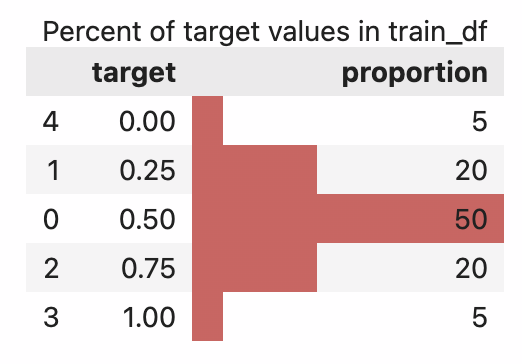

# Numerai learning

This repo contains materials for getting started on Numerai's ML problems. Topics include
1. Convex optimisation
2. ML modelling of numerai tournament
3. Quant Club notes

## Resources
### Convex optimisation for portfolio allocation
1. [Ipython notebook](https://github.com/cvxgrp/cvx_short_course/blob/master/applications/portfolio_optimization.ipynb) from [Boyd's Stanford short course](https://web.stanford.edu/~boyd/papers/cvx_short_course.html)
2. [Slides](https://web.stanford.edu/~boyd/papers/pdf/cvx_applications.pdf) on the application
  of convex optimisation.
3. Linear algebra [Quadratic form](https://sites.millersville.edu/rumble/Math.422/quadform.pdf) 

## Convex optimisation

### Portfolio maximisation formulation
Read through
* the [ipython notebook](https://github.com/cvxgrp/cvx_short_course/blob/master/applications/portfolio_optimization.ipynb) from [Boyd's Stanford short course](https://web.stanford.edu/~boyd/papers/cvx_short_course.html)
* [slides](https://web.stanford.edu/~boyd/papers/pdf/cvx_applications.pdf) on the application
  of convex optimisation.

The following is almost an exact rewrite of the notebook.

We formulate the portfolio allocation across a set of assets as a convex optimisation problem where we want to maximise return and minimise risk.

We have a fixed budget normalised to $\mathbf{1}$ and $\mathbf{1}^T w = 1$ where $w$ is the allocation to each stock. If $w \in R_+$ then we have long only positions.

$$\text{leverage} = ||w||_1 = \mathbf{1}^Tw_+ + \mathbf{1}^T w_-$$

We can short sell and use that money to go long. So we can technically invest more than our total budget.

#### Asset return
Now we define asset return as $\frac{p_i^+-p_i}{p_i}$ where $p_i$ and $p_i^+$ is the stock price at the beginning and the end of the day respectively. For each of the $n$ stocks, we can compute this fraction across multiple days/months/years. Consequently, we can compute the mean asset return $\mathbb{E[r_i]}=mu_i$ and the Covariance matrix $\Sigma=\mathbb{E}\left[\left(\mathbf{r}-\mu\right)\left(\mathbf{r}-\mu\right)^T\right]$. The reason we care for the covariance is that two stocks can vary together (we ignore higher order moments). Recall that the covariance matrix is positive semi-definite, ie., $\mathbf{z}^T \Sigma \mathbf{z} \geq 0, \; \; \forall \mathbf{z} \in \mathbf{R}^n$, that is $\Sigma$ rotates any $z$ by an acute angle.

#### Portfolio Return
We define expected portfolio return $\mathbb{E}[R]=\mu^T w$ and portfolio variance as $\mathbf{Var}(R) = w^T \Sigma w = \sum_i \sum_j (w_i^2 \mathbf{var}(r_i) + w_j^2 \mathbf{var}(r_j) + w_i w_j \mathbf{cov}(r_i, r_j))$, where $i, j \in [1, n]$ are the indices of $\Sigma$. **Risk** is defined as $\mathbf{std dev}(R) = \sqrt{\mathbf{Var}(R)}$.

#### Objective
We want to maximise return while minimising risk. We can set this up as the **classical Markowitz portfolio optimisation**.

$$\begin{align*}
    \arg\max_{\mathbf{w}} \mathbf{w^T\mu} &- \gamma \mathbf{w^T} \Sigma \mathbf{w}   \\
    \text{such that,    } \mathbf{1^Tw}=1 &, w \in \mathcal{W}
\end{align*}$$

#### Risk vs Return trade-off curve
Here $\gamma > 0$ is the **risk aversion factor**. As we increase $\gamma$ and our risk aversion, our expected return will diminish along with risk. We can trace that curve and choose what we determine as the optimal *risk-return trade-off*.



#### Choosing the optimal risk-return trade-off
Above, we approximate the portfolio return by a normal distribution. We can now plot the return at different risk-aversion values $\gamma$ and choose the one we are most comfortable with.


#### Other constraints
1. Max leverage constraint $|w|_1 < L^{max}$. As we increase leverage, we can
   get higher returns for the same risk (defined by stddev). Also higher leverage allows
   us to take higher risks. 
2. Set max leverage and max risk as constraints and optimise return. Here we show
   optimal asset allocations for different maximum leverage for a fixed max risk.
   
3. Market neutral constraint. We want the portfolio returns to be uncorrelated with the
    market returns. $m^T \Sigma w = 0$  where $m_i$ is the capitalisation of the asset
    $i$ and $M=\mathbf{m}^T\mathbf{r}$ is the market return. That is $m_i$ is the
    fraction of the market cap this asset holds. Think what fraction of S&P500 does
    Apple hold. $m^T \Sigma w = \mathbf{cov(M, R)}$  by setting this to zero, we make
    the portfolio uncorrelated with the market. The allocation $w$ vector is rotated
    orthogonal to the market cap fraction vector
    $m \perp  \Sigma w \implies m^T \cdot (\Sigma w) = 0$.

#### Variations
1. Fix minimum return $R^{min} \geq \mathbf{\mu}^T w$ and minimise risk ($w^T \Sigma w$).
2. Include broker costs for short positions $\mathbf{s}^T w_-$.
3. Include transaction fee to change from current portfolio as a penalty
   $\kappa^T |w - w^{cur}|^{\eta}, \kappa \geq 0$. Usual values for $\eta$ are $\eta = 0, 1.5, 2$.
4. Factor covariance model explained later.

#### Variation - Factor Covariance model
In a factor covariance model, we assume
1. Each of the $n$ stocks belong to $k$ factors ($k	\ll n, k \approx 10$) with different proportions (linear weighting/affine). A factor can be thought of as an industry sector (tech vs energy vs finance etc.)
2. Individual stocks are not directly correlated with other stocks but only indirectly
   through their factors.

We can thus factorise the Covariance matrix $\Sigma$ as $\Sigma =  F \tilde\Sigma F^T + D =  F_{[n\times k]} \tilde\Sigma_{[k \times k]} F^T_{[k \times n]} + D_{[n \times n]}$, where 
- $F_{[n\times k]}$ is the _factor loading matrix_ and $F_{ij}$ is the loading of asset $i$ to factor $j$ and
- $D_{[n \times n]}$ is a diagonal matrix where $D_{ii}>0$ with the individual risk of each stock independent of the factor covariance.
- $\tilde\Sigma_{[k \times k]} > 0$ is the factor covariance matrix (positive definite)

Portfolio factor exposure: $f = F^T w \in R^k$. This is a linear weighted sum of the factor
exposures of the fractional assets in the portfolio. To be factor neutral across all factors,
we need $(F^T_{[k\times n]} w_{[n\times 1]})_j=0, \; \forall j \in [1, k]$.

##### Formulation

$$
\begin{align*}
    \arg \max_{w} \mathbf{\mu^T} w &- \gamma \left[(F^Tw)^T \tilde \Sigma (F^Tw) + w^T D w\right] \\
    \implies \arg \max_{w} \mathbf{\mu^T} w &- \gamma \left[f^T \tilde \Sigma f + w^T D w\right] \\
    \text{such that, }f_{[k\times 1]} &= F^Tw \\
    \mathbf{1}^Tw=1,\;  &w\in \mathcal{W}, f \in \mathcal{F}
\end{align*}
$$

Computational complexity to solve the problem falls from $O(n^3)$ to $O(nk^2)$.

In order to leverage this we define the problem like below

<details>
    <summary>Python code for standard and factor portfolio optimisation</summary>

``` python
n = 3000  # number of stocks / assets
m = 50  # number of factors
np.random.seed(1)
mu = np.abs(np.random.randn(n, 1))  # average return = (p_new - p)/p over days
Sigma_tilde = np.random.randn(m, m)  # factor cov matrix Σ'
Sigma_tilde = Sigma_tilde.T.dot(Sigma_tilde)
D = sp.diags(np.random.uniform(0, 0.9, size=n))  # Stock idiosyncratic risk (indep of factor)
F = np.random.randn(n, m)  # Factor loading matrix: how much each stock relates to a factor

# Standard model portfolio optimisation
#######################################

w = cp.Variable(n)  # portfolio allocation
gamma = cp.Parameter(nonneg=True)  # Risk aversion parameter
Lmax = cp.Parameter(nonneg=True)  # Maximum leverage
Sigma = F @ Sigma_tilde @ F.T + D  # [n*n] = [n*k] x [k*k] x [k*n] + [n*n]
preturn = mu.T @ w  # [1*1] = [1*n] x [n*1]
risk = w.T @ Sigma @ w  # [1*1] = [1*n] x [n*n] x [n*1]
# (or equivalently) risk = cp.quad_form(w, Sigma)
prob_std = cp.Problem(
    objective=cp.Maximize(preturn - gamma * risk),
    constraints={cp.sum(w)==1, cp.norm(w, 1) <= Lmax},
)
# Solve it: Takes 15 minutes
gamma.value = 0.1
Lmax.value = 2
prob.solve(verbose=True)
print(f"Return: {preturn.value[0]}, Risk: {np.sqrt(risk.value)}")

# Factor model portfolio optimisation
#####################################
w = cp.Variable(n)
# Make the exposure a variable and constraint it to F^T w = f
f = cp.Variable(m)
gamma, Lmax = cp.Parameter(nonneg=True), cp.Parameter(nonneg=True)
retn_factor = mu.T @ w
risk_factor = cp.quad_form(f, Sigma_tilde) + cp.sum_squares(np.sqrt(D) @ w)
# (or equivalently) risk_factor = f.T @ Sigma_tilde @ f + w.T @ D @ w
prob_factor = cp.Problem(
    objective=cp.Maximize(retn_factor - gamma * risk_factor),
    constraints={
        cp.sum(w)==1,
        cp.norm(w, 1) <= Lmax,
        F.T@w==f,  # NOTE: This is a new constraint
    },
)
# Solve it: Takes 1.2 seconds
gamma.value = 0.1
Lmax.value = 2
prob.solve(verbose=True)
print(f"Return: {preturn.value[0]}, Risk: {np.sqrt(risk.value)}")
print(prob_factor.solver_stats.solve_time)
```
</details>

## Numerai modelling

### Learnings from loading data
_(Updated: 21st March 2023)_

* There are several versions of data, the most recent one being `v4.1`.
* Three types of datasets
  
  | Data split | Rows | Features | Eras         | Notes                                      |
  | ---------- | ---- | -------- | ------------ | ------------------------------------------ |
  | Training   | 2.4M | ~1600    | [0, 574]     | Pandas df: 7.5GB, forums contain xval code |
  | Validation | 2.4M | ~1600    | [575, 1054]  | Pandas df: 7.5GB, this is the test data    |
  | Live       | 5k   | ~1600    | current week | Most recent week's data to predict on      |
* Each training row or validation row is indexed by `(era, stock_id)`. Eras are incremented
  every week.

#### `features.json` file

Contains 

  1. `targets`: These are simply the target column names. The `target` column points to
    `target_nomi_v4_20`. We can train on multiple targets and build a meta model to
    predict on final target.

    | Target type | Number of targets |
    | ----------- | ----------------- |
    | All         | 28                |
    | 20 day      | 14                |
    | 60 day      | 14                |

  2. `feature_sets`: Provides preset features that we can use to quickly bootstrap
  modelling on a smaller feature set or previous versions' feature sets.

  | Feature set            | Count |
  | ---------------------- | ----- |
  | small                  | 32    |
  | medium                 | 641   |
  | v2_equivalent_features | 304   |
  | v3_equivalent_features | 1040  |
  | fncv3_features         | 416   |
  3. `feature_stats`: Contains useful correlation information to rank features. We can
   load up the feature stats in a pandas dataframe with 
   `pd.DataFrame(features_json["feature_stats"])`. Example output

   |                                          | feature_honoured_observational_balaamite | feature_polaroid_vadose_quinze | ... |
   | :--------------------------------------- | ---------------------------------------: | -----------------------------: | --: |
   | legacy_uniqueness                        |                                      nan |                            nan | ... |
   | spearman_corr_w_target_nomi_20_mean      |                             -0.000868326 |                    0.000162301 | ... |
   | spearman_corr_w_target_nomi_20_sharpe    |                                -0.084973 |                      0.0161156 | ... |
   | spearman_corr_w_target_nomi_20_reversals |                              7.04619e-05 |                    8.11128e-05 | ... |
   | spearman_corr_w_target_nomi_20_autocorr  |                                0.0326726 |                     -0.0128228 | ... |
   | spearman_corr_w_target_nomi_20_arl       |                                  3.92019 |                        3.55319 | ... |

    Below is a table that looks at the overlap of the top 100 features according to
    different statistics with the preset feature sets provided by numerai
    
    | statistic                               | feature set            | overlap | feature set size | Percent overlap with fset |
    | --------------------------------------- | ---------------------- | ------- | ---------------- | ------------------------- |
    | corr_w_target_nomi_20_mean     | small                  | 9       | 32               | 28%                       |
    | corr_w_target_nomi_20_mean     | medium                 | 42      | 641              | 7%                        |
    | corr_w_target_nomi_20_mean     | v2_equivalent_features | 40      | 304              | 13%                       |
    | *                                       |                        |         |                  |                           |
    | corr_w_target_nomi_20_autocorr | small                  | 3       | 32               | 9%                        |
    | corr_w_target_nomi_20_autocorr | medium                 | 33      | 641              | 5%                        |
    | corr_w_target_nomi_20_autocorr | v2_equivalent_features | 16      | 304              | 5%                        |
    | *                                       |                        |         |                  |                           |
    | corr_w_target_nomi_20_arl      | small                  | 1       | 32               | 3%                        |
    | corr_w_target_nomi_20_arl      | medium                 | 46      | 641              | 7%                        |
    | corr_w_target_nomi_20_arl      | v2_equivalent_features | 8       | 304              | 3%                        |

    Sharpe correlation is similar to `corr_mean` and `corr_reversals` has a small overlap similar to
    `corr_arl`.

#### Target distribution
See [github gist](https://gist.github.com/psvishnu91/c1360eb9cc5dfe48854c5696c71f5265)
for generating the plot below.



#### Downloading data
See the script `download_numerai_dataset.py` in this folder.

``` python
def download_data(cur_round=None, version="v4.1"):
    """Downloads training, validation and tournament-live data.
    
    It stores them in the following folder structure
    
        data/v4.1/train_int8.parquet
        data/v4.1/validation_int8.parquet
        data/444/v4.1/live_int8.parquet
        data/v4.1/features.json
    """
    cur_round = cur_round or napi.get_current_round()
    Path(f"data/{cur_round}").mkdir(exist_ok=True, parents=True)
    fl_to_downpath = {
        f"{version}/live_int8.parquet": f"data/{cur_round}/{version}/live_int8.parquet",
        f"{version}/train_int8.parquet": f"data/{version}/train_int8.parquet",
        f"{version}/validation_int8.parquet":  f"data/{version}/validation_int8.parquet",
        f"{version}/features.json": f"data/{version}/features.json",
    }
    for filename, dest_path in fl_to_downpath.items():
        napi.download_dataset(filename=filename, dest_path=dest_path)
    print(f"Current round: \t{cur_round}\n")
    downd_fls = '\n\t'.join(str(pt) for pt in Path('data').rglob('*.*'))
    print(f"Downloaded files: \n\t{downd_fls}")
    return cur_round, fl_to_downpath
```

### Model metrics

#### Cross validation
We need custom cross validation code because
1. we want an entire era to act as a group that either appears in training or in the 
   validation split
2. we only want to use past eras as training and never train on future eras and test on
   past eras.

See mdo's post for an [implementation](https://forum.numer.ai/t/era-wise-time-series-cross-validation/791?u=visp).

## Ideas / Open Questions

WKT that diversification reduces portfolio risk (variance) even when choosing amongst assets with
the same expected return and same variances (as long as they are not perfectly correlated).
Could we incorporate this risk computation in the loss function optimised by GBT? Can we use
sharpe ratio as the GBT loss function?


## Quant club notes

### 22 Mar 2023

#### Questions
##### Normalisation

Weighted average signal is passed to the optimiser. no neutralisation is done. The
constraints forces neutralisation. Even if signal is neutral, the portfolio may not be
neutral and hence constraints need to be specified at a portfolio level.

##### New targets?

New targets are going to be shared. Moving away from rank correlation to
pearson corr, makes the predictions guassianised. With the new metric we can get a perfect
corr of 1.

##### New targets closer to TC?
- Some metrics are easier to compute now that you have access to the meta model score.

##### Hitting max capacity with higher AUMs
- Any update on max capacity?
- Max capacity decreases with increasing AUM. Gradual and smooth shift. No clear fall off.
- Daily trading can help here.
- Hoping to get to 1B\$ AUM by end of the year. Still have headroom

#### Main talk: LightGBM settings
- Interesting settings in lightgbm. Some of them have similar settings in xgb but not
    all settings.
  - _**Monotone constraints**_: A list [1,-1,0] length, length of feature. You can enforce
    that this feature should always be monotonically increasing or decreasing.
    Especially for composite features.Now there are more advanced papers but are similar.
    mdo's experience: They don't necessarily help with raw model performance but can help
    with sharpe, TC regularisation.
  - _**Linear tree**_: Builds a linear model at the end of the space. Makes the model
    more linear at the end where it flattens out. There are several lambda params to
    regularise these. Possible in `lightGBM` and not in xgb.


#### Main talk: XGB as a feature selection & weighting (OHE)

* XGB Discretisation and weighting of features.
* Imagine 5-depth binary DT classification. Splits into 2^5 32 bins. Mixed bins with roughly equal counts 0.5 predictions.
* For pure data bins like the one numerai dataset. If it has very high tree leaf weight but very few datapoints then might not generalise.
* But with ensembling you learn a series of features and feature spaces. You get an output an one hot encoded output for each leaf.
* XGB let's you dump the model `get_dump` function. You can convert the xgboost model prediction to a python code. We can compute the leaves. At the end of xgb, you can think of a DNN, it throws a weighting on input space and creates an embedding.
* XGB has an apply function which returns the index of the nodes in the output. If input is n,p features and and you fit T trees, then the output is n x T, where each entry in T is the tree node. Now you can create a OHE of the features. n x (T x num_leaves). num_leaves 100*2^5=3200.
* If you had leaf weights times the OHE features you will get the prediction of the xgboost model.
* The plot of feature values is the average value of parameters for each subspace. The spikes in the spaces could be useful space or could be noise. 
* Most average parameter space is close to 0. The instances are highly non-separable so the impact is almost 0 for most cases.
* On the final features you could do linear regression.
* L1 leaves which are small perhaps shrink those to zero. 
* Shrink the spaces with fewer number of datapoints than spaces with larger number of datapoints. Shrink by 1/sqrt(n) (confidence interval/margin). Shrink out the high variance leaves.
* 1/sqrt shrinking better correlated with unshrinked output from xgb than unweighted L1.
* Unweighted L1 improved sharpe by decreasing variance. However the expected gain dropped sharply. The weighted L1 had a much more modest drop in expected gain by retaining most of the variance wins.