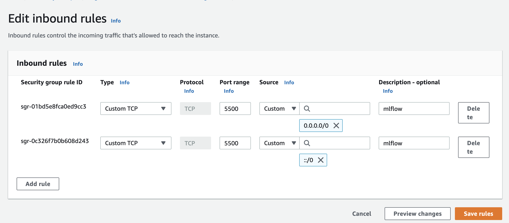
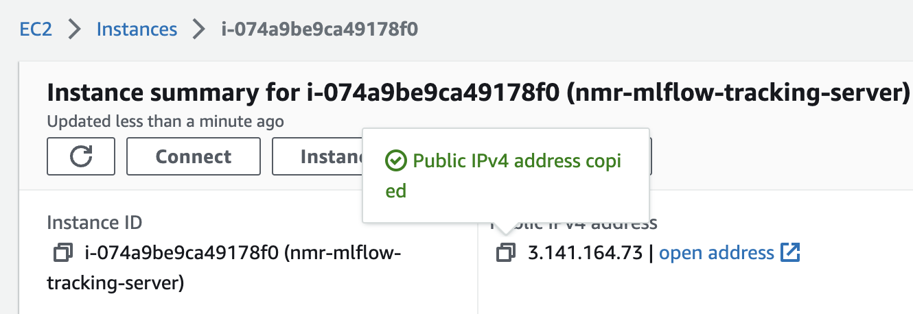
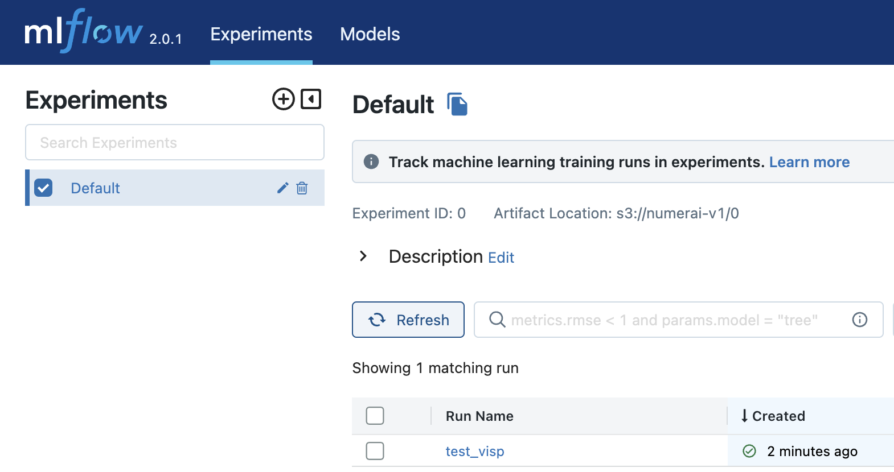
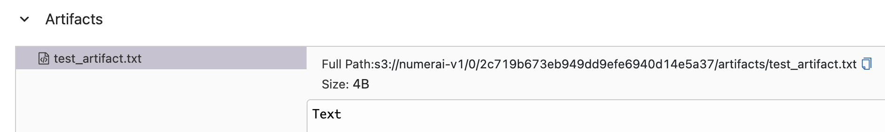

# Introduction
An mlflow serving tracker setup to monitor the numerai modelling.

# Setup
## AWS - EC2 and S3
1. git clone this repo `git clone https://github.com/vispz/numerai.git`.
2. Setup security group `mlflow-tracking-server` as below. Here I have set access
   from anywhere in the internet. \
   
3. Create an s3 bucket. In this repo, we call it `numerai-v1`.
4. Start a new `t3.nano` instance on EC2. Set the above security group.
   We can use a EBS volume of 10GB.
5. Run `bash upload.sh <ec2 instance id>` from your local machine, replacing the
   appropriate cred file locations. Example:
   `bash upload.sh ubuntu@ec2-3-17-6-177.us-east-2.compute.amazonaws.com`.
6. SSH into the AWS EC2 instance and run `setup_mlflow.sh`. This needs to be run once
   (can be run again).
7. Run `bash -x run_mlflow.sh <postgres-password>` to run the docker container
   running mlflow. See RDS section.


## Connecting to an RDS backend
Steps in setting up RDS cluster

1. Create postgres cluster in aws RDS (you can use the default setup). Remember
   your master password.
2. In AWS Console, select Actions -> setup EC2 connection
([link](https://docs.aws.amazon.com/AmazonRDS/latest/UserGuide/ec2-rds-connect.html))
and connect the mlflow EC2 instance to this RDS. From documentation:
   ```
   To set up a connection between the database and the EC2 instance, VPC security group
   rds-ec2-1 is added to the database, and VPC security group ec2-rds-1 is added to the
   EC2 instance.
   ```
3. In the EC2 machine
``` bash
ubuntu@ip-172-31-0-158:~$ sudo apt install -y postgresql-client
$ psql --host=mlflow.cwtakrybmksl.us-east-2.rds.amazonaws.com --port=5432 --username=postgres --password
Password:
```
``` sql
postgres=> CREATE DATABASE mlflow;
CREATE DATABASE
postgres=> \l
                                  List of databases
   Name    |  Owner   | Encoding |   Collate   |    Ctype    |   Access privileges
-----------+----------+----------+-------------+-------------+-----------------------
 mlflow    | postgres | UTF8     | en_US.UTF-8 | en_US.UTF-8 |
 postgres  | postgres | UTF8     | en_US.UTF-8 | en_US.UTF-8 |
...
(5 rows)
``` 
After adding experiments
``` bash
# note that I have added the db name to the command
psql --dbname=mlflow --host=mlflow.cwtakrybmksl.us-east-2.rds.amazonaws.com --port=5432 --username=postgres --password
```
``` sql
mlflow=> select * from experiments;
 experiment_id |          name          |    artifact_location     | lifecycle_stage | creation_time | last_update_time
---------------+------------------------+--------------------------+-----------------+---------------+------------------
             0 | Default                | s3://numerai-v1/mlflow/0 | active          | 1681912904158 |    1681912904158
             1 | sunshine-ntrlsn-propn  | s3://numerai-v1/mlflow/1 | deleted         | 1681915424116 |    1681915518502
             2 | sunshine-ntrlsn-propn1 | s3://numerai-v1/mlflow/2 | active          | 1681915574279 |    1681915574279
(3 rows)
```

## [Only if building from source] Building docker image
``` shell
numerai/mlflow$ docker build --platform linux/amd64 -t vishnups/mlflow-visp .  && \
   docker push vishnups/mlflow-visp
```


## Access MLFlow
Access the mlflow tracker `http://<public_ip>:5500`.\
   

## Example tracking

``` python
import mlflow
mlflow.set_tracking_uri("http://<ip>:5500")
with open("test_artifact.txt", "w+") as outfile:
   outfile.write("Text")
mlflow.start_run(run_name="expt_1")
mlflow.log_artifact("test_artifact.txt")
mlflow.end_run()
# with context manager
with mlflow.start_run(run_name="expt_2"):
    mlflow.log_artifact("test_artifact.txt")
```

## Output

