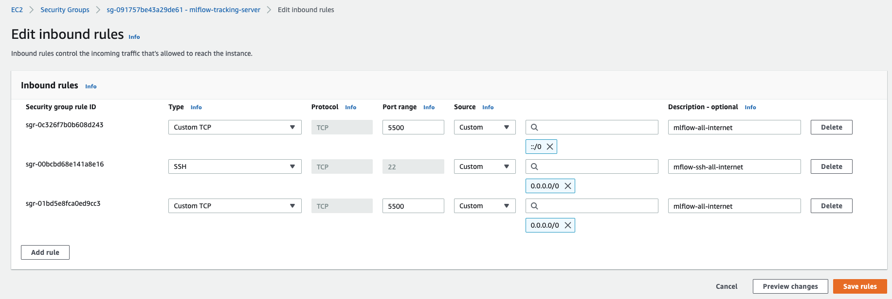

# Introduction
An mlflow serving tracker setup to monitor the numerai modelling.

# Setup
## AWS
1. git clone this repo `git clone https://github.com/vispz/numerai.git`.
2. Setup security group `mlflow-tracking-server` as below. Here I have set access
   from anywhere in the internet. \
   
3. Create an s3 bucket. In this repo, we call it `numerai-v1`.
4. Start a new `t3.nano` instance on EC2. Set the above security group.
   We can use a EBS volume of 10GB.
5. Run `bash upload.sh <ec2 instance id>` from your local machine, replacing the
   appropriate cred file locations. Example:
   `bash upload.sh ubuntu@ec2-3-17-6-177.us-east-2.compute.amazonaws.com`.
6. SSH into the AWS EC2 instance and run `setup_mlflow.sh`. This needs to be run once
   (can be run again).
7. Run `run_mlflow.sh` to run the docker container running mlflow.


## Building docker image
Even better if you can build it inside an ec2 instance and upload but I had issues.
If you have to do it in a mac.

``` shell
docker buildx create --use
docker buildx build --platform linux/amd64,linux/arm64 -t vishnups/mlflow-visp .
docker push vishnups/mlflow-visp
```

# Access MLFlow
Access the mlflow tracker `http://<public_ip>:5500`.\
   

## Example tracking

``` python
import mlflow
mlflow.set_tracking_uri("http://<ip>:5500")
with open("test_artifact.txt", "w+") as outfile:
   outfile.write("Text")
mlflow.start_run(run_name="expt_1")
mlflow.log_artifact("test_artifact.txt")
mlflow.end_run()
# with context manager
with mlflow.start_run(run_name="expt_2"):
    mlflow.log_artifact("test_artifact.txt")
```

## Output


## Bake the AMI
To prevent having to rerun this script many times, I baked this. See
[AWS docs](https://docs.aws.amazon.com/toolkit-for-visual-studio/latest/user-guide/tkv-create-ami-from-instance.html)
for details.